# 4000 a.u. 验证与 50 轨道 / 25 电子扩展

更新：2026-09-08。本报告区分已完成实测、容量估算、尚在运行任务和未验证候选代码。完整 50/25 精度结论尚未得出。

## 10/5：三次独立百万路径运行已完成

物理参数沿用现有验证：wc=2.7 eV，eta=3e-7，delE=-17.194874968839816 eV；dt=0.5，8000 步，0–4000 a.u.。每次 100 万路径、64 进程、D3、384 个振动态。三次都复用生产任务 647717 的参考；该生产任务程序墙钟 24.08 秒、Slurm 26 秒，最大进程峰值 15.684 MiB，峰值和 0.856 GiB。

QM 对照是任务 647656 的完整多电子网格传播，1024 个空间网格点、252 个电子组态。已完成真实求解器资源补测 647783：同参数、单进程、0–4000 a.u.，进程墙钟 3267.39 秒（54.46 分钟），进程峰值 19860 KiB = 19.395 MiB，用户/系统 CPU 分别为 3266.55 / 0.07 秒，总 CPU 0.9074 小时。外层启动器墙钟 3268.20 秒，资源结论采用 MPI 内包住实际求解器的统计。详细验证见 scan_v115_generality_20260906/qm_resource_validation.json。

两次 QM 数据不逐位相同：全部列最大差异 5.18e-13，占据数最大差异 2.58e-13；仅为诊断按各自范数归一后差异为 6.66e-16。对应发布标签之间 QM 传播源码未变化，差异与微小范数漂移一致；使用新 QM 重新计算六版最差 Q，变化不到相对 6e-13，结论不受影响。原 QM 数据及原拟合定义保留，不为追求一致性改写数据。固定网格/时间步的重复一致仍不是网格或步长收敛证明。

Q = RMS(QM 占据数 − 初始占据数) / RMS(Poisson 占据数 − QM 占据数)。活跃轨道为杂质 0 和初始空轨道 5–9；初始已占浴轨道 1–4 的信号极小，以所有轨道的绝对误差与全轨道图同时检查，不将其不稳定的相对 Q 混入活跃轨道阈值。

| 作业 / 种子 | 单次最弱活跃轨道、最差 100 a.u. 窗口 Q | 全程活跃轨道综合 Q | 墙钟分钟 | 最大进程峰值 MiB | 进程峰值和 GiB | 分配进程小时 |
| --- | ---: | ---: | ---: | ---: | ---: | ---: |
| 647718 / 1144001 | 11.858 | 144.023 | 63.560 | 15.660 | 0.866 | 67.80 |
| 647719 / 1144002 | 11.169 | 134.082 | 60.963 | 15.578 | 0.858 | 65.03 |
| 647720 / 1144003 | 16.821 | 174.054 | 63.521 | 15.574 | 0.858 | 67.76 |

三次各自通过上述 Q>10 指标，不依赖三次平均才能达标。平均的最弱 Q=23.387 仅作为额外重复性信息。单次所有轨道最大绝对误差分别为 2.9183e-8、2.4738e-8、2.8736e-8。100 a.u. 窗口 Q 是窗口 RMS 指标，不意味着每一个时间点的相对误差均小于 10%。

峰值和为各进程峰值相加，不是同步总 RSS。分配进程小时=进程数×墙钟时间，并非实际 CPU 小时。约一小时的 64 进程 Poisson 不能宣称比约 55 分钟的单进程 QM 节约计算。小体系并非此算法的优势场景。

旧的 10,000 路径任务 647657 最弱 Q=1.256，没有通过；不同路径数、进程数与种子使这不是仅改变程序版本的受控测速。v1.13/v1.14 数值等价已另用同参数回归证明。

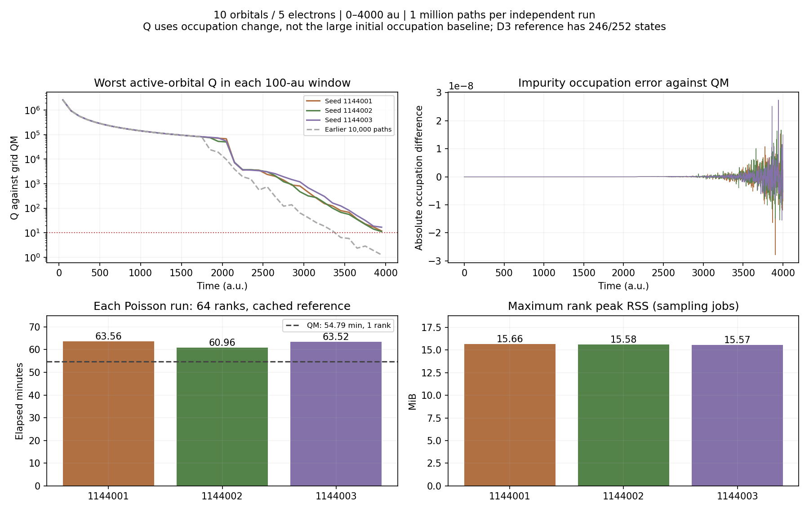

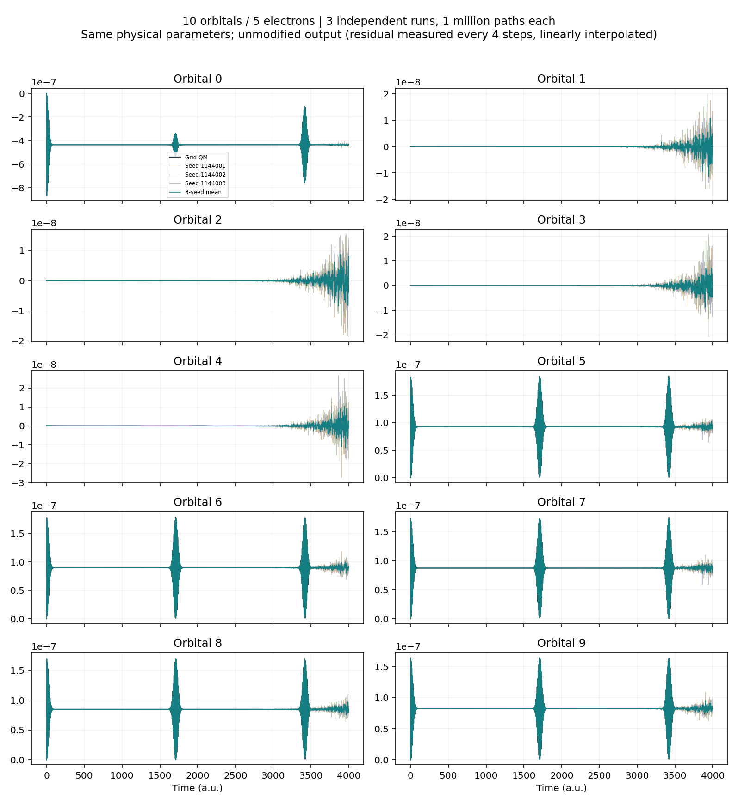

输出保留原值，无剪裁。但程序本身仅每 4 步直接测量一次随机残差，中间线性插值，参考每步计算。不能把全部 8001 行都称为独立直接采样点。D3 覆盖 246/252 个电子组态，接近完整空间；该小体系高 Q 不能单独证明大体系高效或普适。

## 30/15：完整参考和三次独立百万路径结果

4000 a.u. 的 D3/F384、D3/F512 参考任务 647702、647703 已完成；三次独立百万路径 647704、647705、647706 均完成。相同种子的 F512 对照 647707 仍在运行。

| 任务 | 程序墙钟 | 最大进程峰值 MiB | 峰值和 GiB | 进程数 |
| --- | ---: | ---: | ---: | ---: |
| D3/F384 参考 + 100 路径 | 16.350 小时 | 237.195 | 29.414 | 128 |
| D3/F512 参考 + 100 路径 | 19.888 小时 | 258.992 | 32.156 | 128 |
| F384 缓存 + 100 万路径，种子 1134001 | 5.917 小时 | 22.773 | 2.412 | 128 |
| F384 缓存 + 100 万路径，种子 1134002 | 5.970 小时 | 21.285 | 2.403 | 128 |
| F384 缓存 + 100 万路径，种子 1134003 | 6.241 小时 | 21.375 | 2.388 | 128 |

这些任务锁定为 v1.13 程序，因此其参考内存大于后续 v1.14 符号压缩版本。采样复用参考，不能把 5.917 小时、2.412 GiB 当作首次完整运行的全部成本。

D2/F384 与 D3/F384 全程最大轨道差异为 6.66e-16；D3 的 F384 与 F512 最大差异为 9.70e-11。这说明在已比较的参考层级内，增加 D 或 F 不太可能消除当前的随机噪声，但相邻截断收敛不是完整空间的严格误差界。

首个百万路径结果与 D3/F384 参考的最大轨道差异为 2.764e-7；归一化后、未剪裁的占据数最小为 -2.345e-7，最大为 1.0000002764。输出未剪裁。这些波动与目标物理占据变化相比不可忽略。最差 100 a.u. 窗口的“参考信号 RMS / 样本相对参考差异 RMS”综合值为 2.718，最弱活跃轨道为 0.510。它们只是残差诊断，不是真实 QM 拟合；尤其早期几乎零残差形成的巨大比值不能视作真实高精度。

三次各自与参考的最大轨道差异为 2.764e-7、4.814e-7、6.477e-7；最弱活跃轨道窗口诊断分别为 0.510、0.459、0.295。三种子平均的最大 SEM 为 2.161e-7，最弱窗口的“平均信号 / SEM”仅为 1.181。这是重复性诊断，不能当作真实 QM Q，也不能用平均替代单次达标要求。三次种子只有很有限的方差估计能力，极早期几乎没有残差也不足以证明没有罕见事件误差。

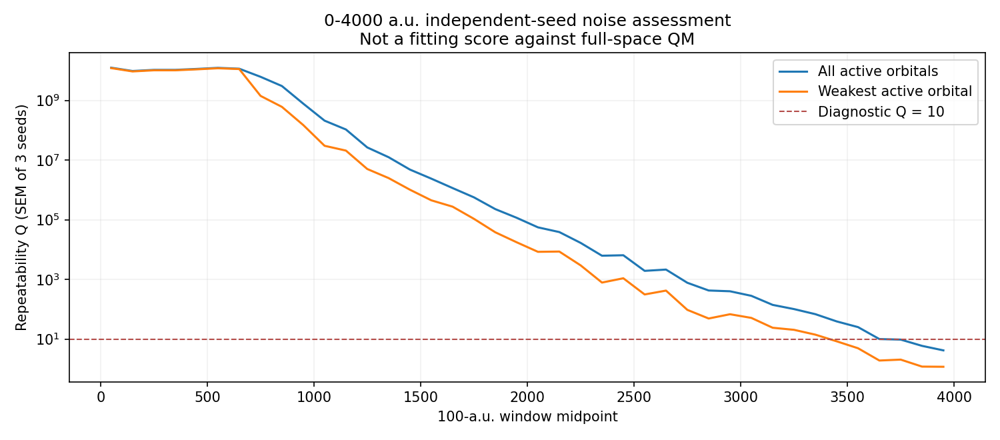

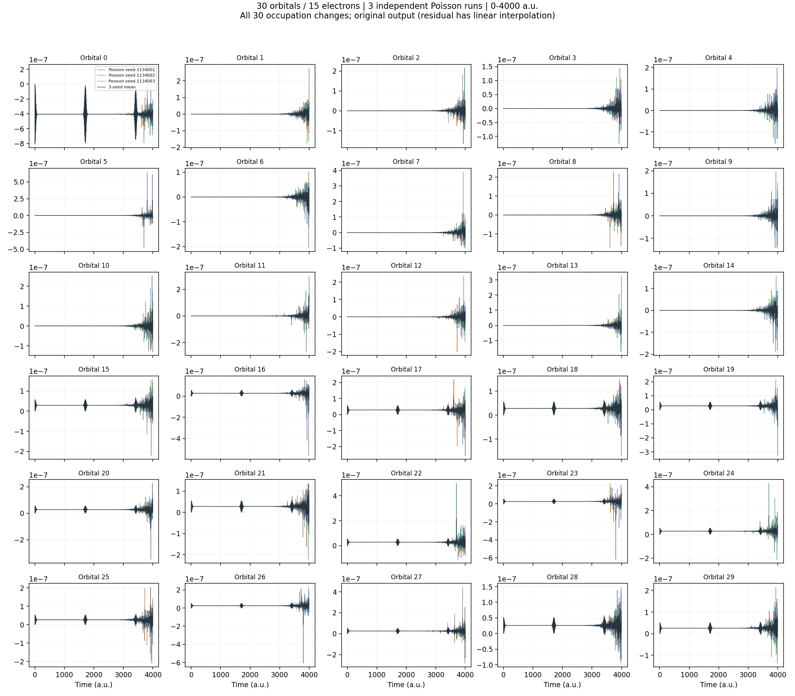

因此，30/15 的单次全程高拟合目标尚未达到。在通常的误差随路径数平方根下降的粗略假设下，只增加路径数也难在两天内把这一最弱诊断指标提升到 10；分层相关性与稀有大权重还会影响该估算。下一步优化应针对随机路径方差，并检查有限时间步和抽样离散化，不能仅靠增加参考态数或在没有采到稀有路径时宣称收敛。

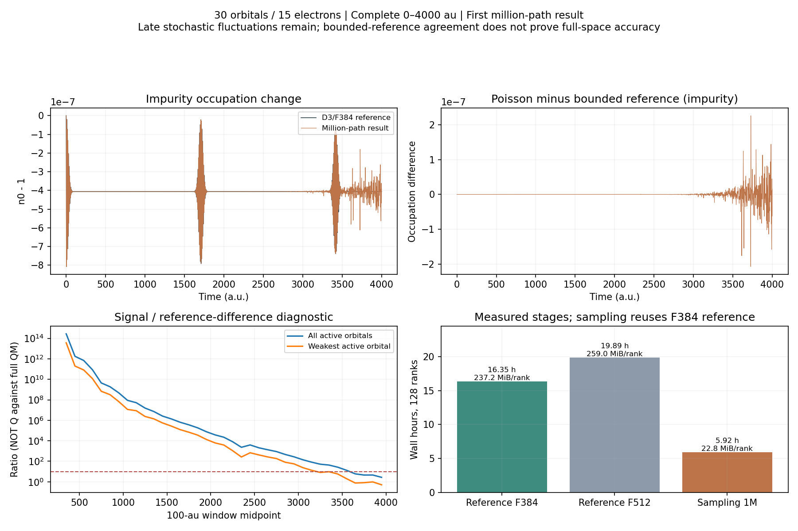

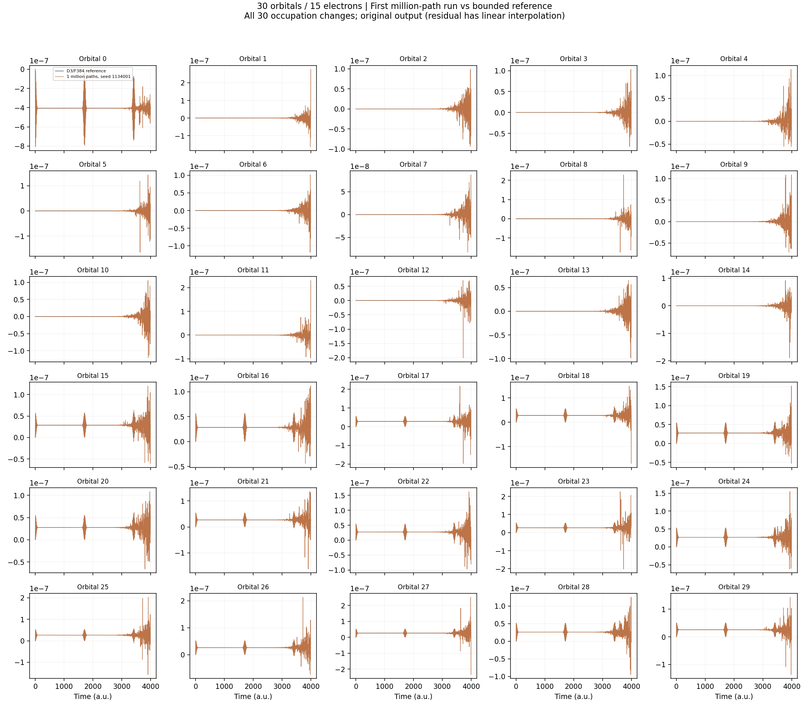

## 50/25：D1/D2 全时域试跑均完成，高精度仍未达标

完整电子组态数 C(50,25)=126410606437752。按复数双精度、1024 个网格点，一个 QM 波函数需 2071111375876128768 字节，约 1.7964 EiB（2.0711 EB），另需势能、工作数组和基组元数据。这是容量下界估算，不是实际执行大 QM 的测量结果。旧整数索引也无法容纳该空间。

对初始杂质占据的星形图，a=Nel−1、b=Norb−Nel：

- 有界参考态数 S(D)=Σ[d=0..D] C(a,d)[C(b,d)+C(b,d+1)]。
- 有向边数 E(D)=2b Σ[d=0..D] C(a,d)C(b,d)。
- 两个参考工作数组占 32 F S(D) 字节，F 为振动态数；符号图每进程约 8(S+1)+4E 字节。

50/25、F384：D1 有 7826 态，两个数组约 0.090 GiB；D2 有 725426 态，约 8.302 GiB；D3 有 30984226 态，约 354.586 GiB。D3 的图表每个进程还约 1.114 GiB，因此不会盲目扩大阶数。

已有 v1.14 程序的 50/25、D2、10 a.u.、100 路径、128 进程短测任务为 647776。日志确认实际 D2、725426 态、4170050 条有向边、F384，没有降阶。短测已完成并通过时间网格、缓存校验和、实际参考规模及完成标记检查：程序墙钟 189.71 秒（Slurm 3 分 13 秒），参考传播 187.12 秒，最大进程峰值 190.387 MiB，峰值和 23.570 GiB，原始参考范数最大偏差 2.66e-14。它是功能与容量测试，不能证明 4000 a.u. 精度。

已提交完整 4000 a.u. 系列：647777 为 D2/F384/128 进程主参考与 1000 路径试采样；647778 在其成功后复用参考跑 10000 路径；647779 在其成功后做 D2/F512 截断检查；647780 为 50/25 的 D1；647781 为 50/17 非半填充 D1；647782 为 50/25 关闭参考的当前版本消融对照（不是声称重跑了某个旧版本）。后三者各 1000 路径、64 进程。具体清单为 scan_v115_generality_20260906/long_4000_jobs.tsv。

已收齐后三个完整 4000 a.u. 试跑，8001 行、实际物理参数、求解分支、参考态数、参考校验和与完成资源记录均通过检查。**这只表示文件与配置有效，三个试跑的精度均未通过。**

| 任务 | 轨道 / 电子，模式 | 墙钟分钟 | 参考秒 / 采样秒 | 最大进程峰值 MiB | 进程峰值和 GiB | 未剪裁占据数范围 |
| --- | --- | ---: | --- | ---: | ---: | --- |
| 647780 | 50/25，D1，1000 路径 | 13.381 | 306.703 / 494.563 | 27.668 | 1.532 | −0.1402 ～ 1.1412 |
| 647781 | 50/17，D1，1000 路径 | 11.323 | 366.287 / 311.453 | 25.789 | 1.411 | −0.07224 ～ 1.07206 |
| 647782 | 50/25，无参考，1000 路径 | 7.847 | 不适用 / 469.313 | 26.137 | 1.506 | −2895.50 ～ 2961.46 |

以上均为 64 进程。两个 D1 原始参考范数最大漂移约 1.05e-13、1.19e-13；但 Poisson 结果与各自参考最大偏离达 0.378、0.0880，不能宣称高精度。无参考结果幅度失控，说明低内存并不自动带来可接受的统计精度；它也不构成所有纯 Poisson 参数方案的否定。

现有按步固定中点分层使每步跃迁数通常固定为 floor(N*p+0.5)，相等边界按严格小于条件计数。50/25、1000 路径时实际边缘跃迁概率比目标低 31.74%，50/17 时低 27.96%；这是事件概率误差，不是占据数的百分比误差，且大权重方差、有限步误差和控制残差也共同影响结果。因此这几组保留为失败试跑，不能拿来证明普适高精度。1000 路径的 D2 生产任务仍可提供有效的确定性参考，随机输出需同样标注；后续 10000 路径的对应概率误差为 +2.39%，也不能直接视为无偏正式结果。

D2/F384 主任务 647777 及缓存一万路径任务 647778 已完成并收齐完整 4000 a.u. 数据。主作业 79102.73 秒（21.973 小时），其中参考 78168.21 秒、采样 931.70 秒；最大进程峰值 199.047 MiB，128 进程峰值和 24.486 GiB。缓存一万路径作业 858.97 秒（14.316 分钟），最大进程峰值 27.504 MiB，峰值和 3.040 GiB。

这两次采样与 D2 参考最大占据差异分别为 3.287e-3、7.403e-4，仍出现负占据数，不能视为高精度。D1/F384 与 D2/F384 确定性参考最大差异仅 5.662e-15；这支持将优化重点放在随机残差估计，但相邻截断一致不能排除共享偏差。D2/F512 对照 647779 于 2026-09-08 09:14 仍在运行，日志到 2500 a.u.。

与 QM 和各版本的最新综合比较见 [QM_POISSON_COMPARISON_4000.md](QM_POISSON_COMPARISON_4000.md)。

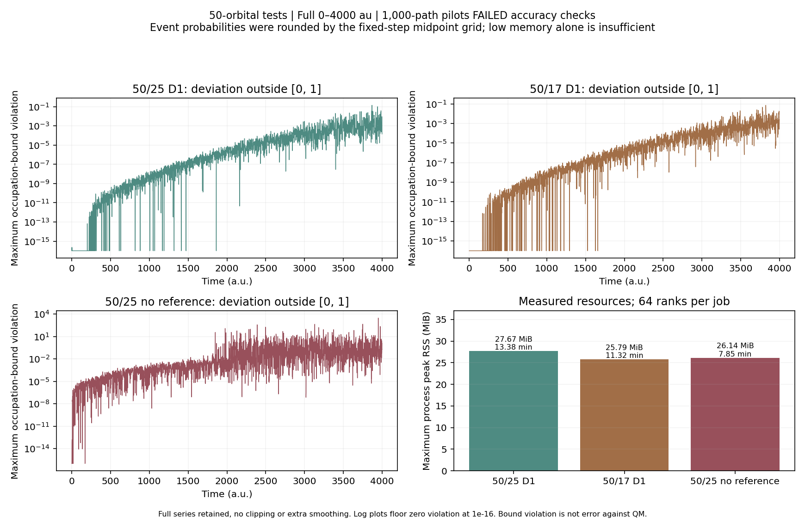

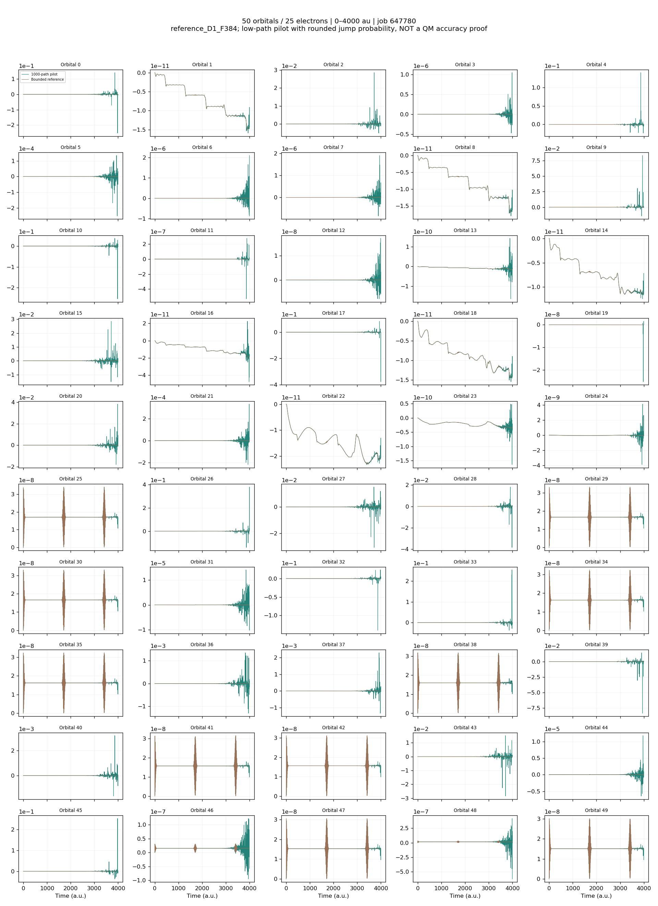

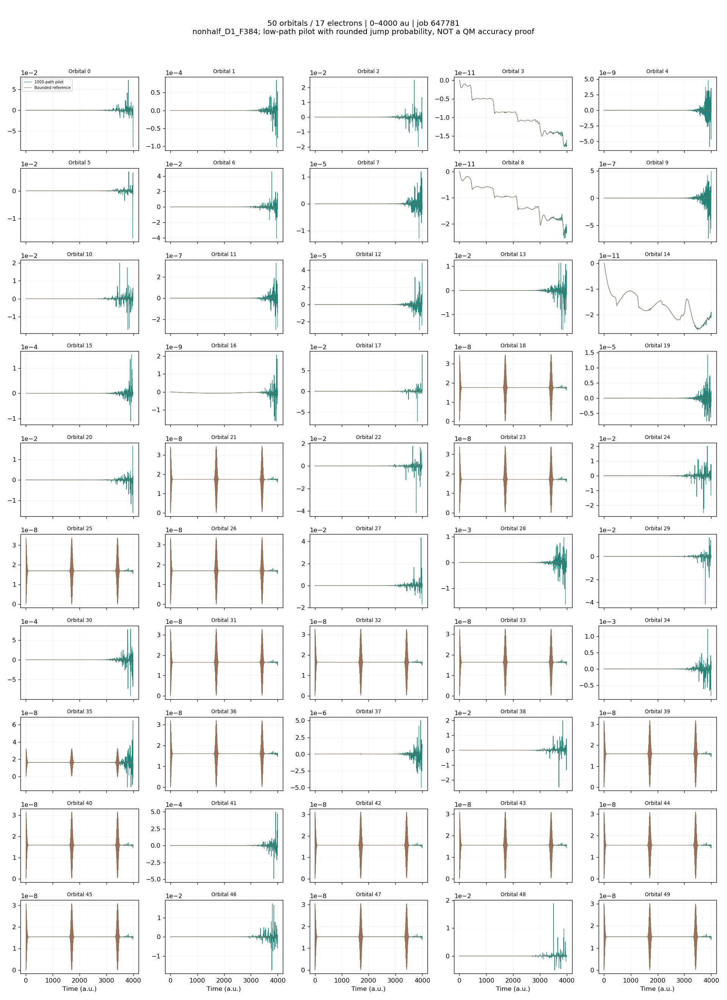

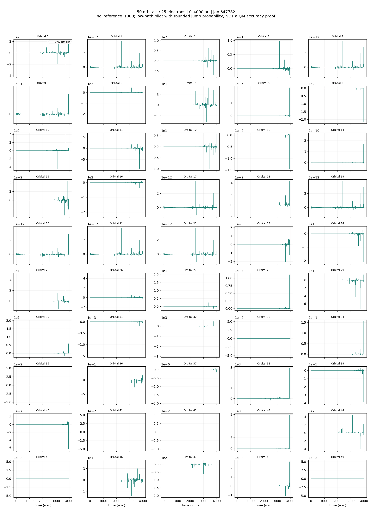

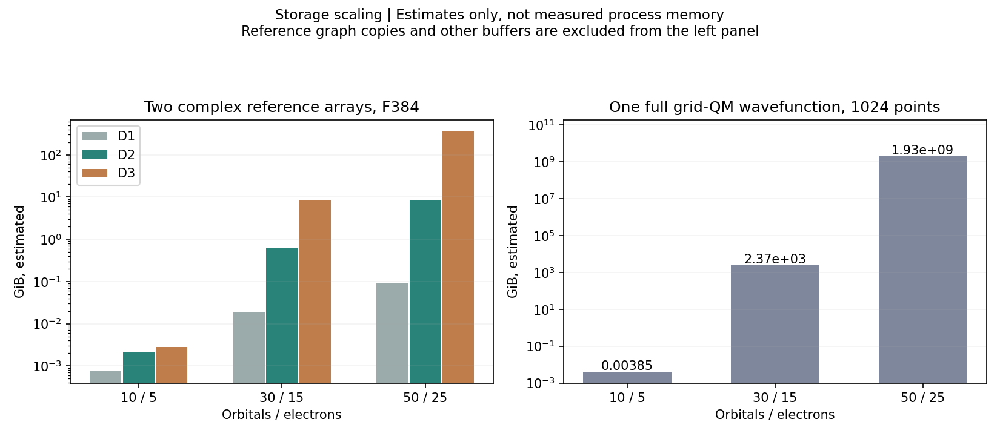

## 各版泊松方法与 QM 的关系

逐标签源码功能清单保存在 scan_v115_generality_20260906/release_feature_inventory.json，含 15 个标签及对应提交。服务器留存的 v0.93、v0.96、v0.98、v1.03、v1.09、v1.14 六份程序已完成受控重跑 647800–647805：同一 10/5、0–4000 a.u.、10000 路径、64 进程、种子 1158001，使用同一 QM 数据计算 Q。实际浴能量/耦合、完整时间网格、随机分支与二进制 SHA 均已核验。新选项在旧版中可能被忽略：例如 v0.93 实际未应用 rate_scale=1.5；实际输出头完整保存在验证 JSON。留存二进制名称和 SHA 不等于它们已从当前标签重新构建的证明。

| 程序 | 最弱活跃轨道窗口 Q | 全程活跃轨道 Q | 墙钟秒 | 最大进程峰值 MiB |
| --- | ---: | ---: | ---: | ---: |
| v093 | 1.93021e-05 | 8.57162e-05 | 39.08 | 14.781 |
| v096 | 5.61004e-06 | 4.39163e-05 | 43.88 | 14.805 |
| v098 | 4.58675e-06 | 3.68442e-05 | 45.99 | 14.977 |
| v103 | 1.59071 | 22.356 | 275.54 | 15.953 |
| v109 | 1.58241 | 23.9925 | 471.94 | 15.965 |
| v114 | 1.58241 | 23.9925 | 55.92 | 15.418 |

本次 v1.09 与 v1.14 的占据数最大差异仅 1.44e-15，墙钟从 471.94 秒降到 55.92 秒，速度比 8.44。说明本次参数下实现优化有效；这是单次、同路径数对照，不能外推为任意规模的加速比。v1.14 进程峰值和为 0.8485 GiB，旧版未记录峰值和，留空而不伪造。它们的 64 进程并行成本与 QM 单进程不能只比较一个进程的 RSS。

六个版本在一万路径下都未通过最差窗口 Q>10。早期三版出现大幅非物理波动；参考控制系列明显改善，但精度相近并不等于满足目标。v1.14 的百万路径三种子结果见前文，在小体系已各自达标。尚未完成所有版本在同一误差目标下各自优化后的成本比较，不将这张表用作最终性价比排名。

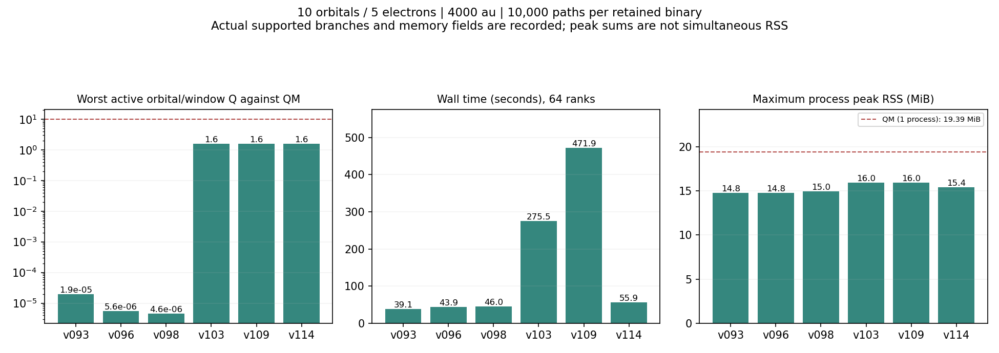

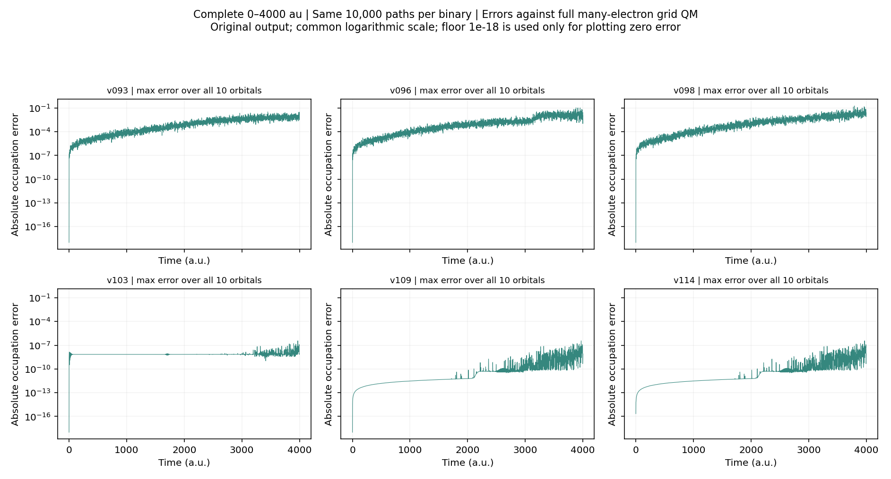

下表保留机制及可扩展性比较。

| 版本系列 | 主要思路 | 内存与精度的实际边界 |
| --- | --- | --- |
| 网格 QM | 完整多电子波函数及确定性传播 | 内存随 C(Norb,Nel)×网格点增长；50/25 不可直接运行 |
| v0.92–v0.94 | 低内存后向表；v0.93 加自动确定性 Fock 分支 | 比早期时间平方表省内存，但旧驱动仍可构造完整电子基；必须确认实际分支，不能将自动 Fock 结果称纯泊松 |
| v0.96、v0.98 | 调整提议速率、轨道/时间/Kondo 路径分层 | 主要降低采样方差，不能消除长时间符号/相位抵消；尚无路径局部大空间入口 |
| v0.99、v1.03 | 有界参考控制，加入随机化分层重复 | 额外确定性参考内存换取更小随机残差；重复一致并不排除共同偏差 |
| v1.09 | 嵌套分步参考、路径是否离开参考空间的残差控制 | 小体系参考近乎完整时精度很高，但仍要检查原驱动的全基组开销 |
| v1.10 | 路径局部态，跳过完整基组和全空间相位表 | 能进入巨大组合空间；参考传播最初集中在单进程 |
| v1.11 | 分布振动维度的参考传播 | 分摊大工作数组，图/其他元数据仍有重复 |
| v1.12 | 64 位参考态、精确跳过零残差工作 | 同参数 D2/30/15/64 进程短测最大 RSS 从 144.51 降至 41.13 MiB，保留数值结果 |
| v1.13 | 连续稀疏跃迁表、两个工作数组、参考缓存复用 | 减少参考内存和多种子重复计算；缓存消费者不应被遗漏参考生产成本 |
| v1.14 | 等幅耦合用索引编码符号 | 同节点 D3/30/15/128 进程约 232→192 MiB/进程、28.8→23.8 GiB 峰值和，数值相同，参考时间基本相同 |

## 是否符合论文“用时间换内存”的目标

依据项目提供的 Yun-An Yan、Zhenggang Lan、Jiushu Shao《Poissonization of Quantum Dynamics and Applications》原稿，重点为式 (2)、(3)、(16) 和第 5–6 页。原稿保留在本地，不把整篇论文随结果公开上传。

符合的部分：仍将 H=H0+H1 分解，核在条件谐势上以相干态传播，通过随机电子跃迁和权重平均计算结果；路径局部表示避免存储完整组合空间波函数，更多路径用计算时间换统计精度。v1.11–v1.14 是对有界参考的存储和实现优化。

需要明确的差别：当前是“有界确定性参考 + 泊松残差”的混合方法，参考部分本身存在明显内存成本。它相对完整 QM 大幅省内存，但不是保持原始纯路径方法那样极小且与参考态数无关的内存。固定较小 D 时有界参考随轨道数按多项式增长，若为精度不断增大 D，则可能重新接近组合爆炸。

论文算例的电子态为分子态与金属态组成的 N+1 维表示，初态只有一个电子分量被占据；其“所需样本数不随 N 增长”的数值观察，不能直接外推至 25 个电子、50 个轨道的半填充 Fock 空间。原稿本身也指出长时间方差增长，因此不能保证任意耦合、任意时间都能在固定一两天内高精度完成。

本实现的随机路径部分显式要求实数且所有浴耦合相同，核势为这里的谐势模型。参考图的非等耦合回退验证并不意味着整个生产求解器已支持任意耦合。所谓普适性目前只能在这一物理模型内，以多组轨道数、电子数及填充测试逐步证明。

## 新发现与待验证修正

1. 归一化输出强制粒子数为 Nel，其“守恒”不能证明传播无偏。候选代码新增原始范数、原始占据数与直接采样标记。
2. 泊松路径的有限步实现采用 p=r dt/(1+r dt)，加权一步的期望为 I−iH1 dt，不是 exp(−iH1 dt)。独立 H0=0 两能级诊断在 T=4000、dt=0.5 的原始范数漂移约 6.00e-4；归一化会隐藏这一主导漂移。这是诊断模型，不是实际 AHM 误差估计。论文连续时间恒等式不自动证明有限步混合代码完全无偏，需进一步步长收敛测试。
3. 固定格点的前向分层使用 (置换索引+0.5)/Ntraj，有限路径数下事件比例有舍入误差；提议速率补偿不自动消除该有限样本偏差。当前尚未改动该抽样规则，避免未经回归就替换正在运行的实验。
4. AHM 构造函数部分标量未初始化；候选代码初始化它们，避免路径局部模式跳过全基组后读取未定义 Nhs。
5. 网格 QM 的 Nhs==Norb 分支条件也会在单空穴多电子体系成立。候选代码将其改为 Nel==1；该更正不改变已完成的 10/5、30/15 数据，需增加单空穴 QM/参考对照。
6. 旧 Poisson 函数还保留了基于 Nhs==Norb 的历史冻结核快速分支。当前生产明确使用路径局部模式以绕过它，不能把其他旧入口视为普适已验证。
7. 候选驱动增加完整空间容量/整数安全检查、可设置 dt 和实际 CPU/进程峰值统计。目前源码已在本地修改，远程上传需等待当前自动审批确认；尚未把它称为已验证发布版。

所有已提交服务器的实验继续使用已验证的 v1.14 或原队列锁定的 v1.13。后续需要完整 50/25 数据、D1/D2 及 F384/F512 收敛、非半填充对照和直接采样/步长检查，再给出最终精度及普适性结论。

## 针对末段方差的补充筛选

原速率数组 647806 在全部子任务尚未执行时取消，替换为 647807：按步分层开启/速率 1.5 与按步分层关闭/速率 1.0、1.5 三档，各两个独立种子、10 万路径、4000 a.u.。关闭按步分层后使用现有程序已有的随机平移总跳数 CDF 模式，以测试这一处事件数舍入偏差。固定同一哈密顿量与 D3/F384 缓存参考，逐进程记录实际 CPU 与 RSS。

原模式的两个对照 647807_0、647807_1 已完成，墙钟约 36.97、36.91 分钟，实际 CPU 总计 78.73、78.60 小时；最大进程峰值 21.16、22.82 MiB，峰值和 2.394、2.405 GiB。最弱相对参考诊断为 0.162、0.0257，表明种子间尾部波动明显。新模式尚待收齐，不能提前宣称成功。详细设置、旧任务取消记录和完整资源验证见 scan_rate_4000_20260907/README.md、sampling_validation.json。候选还需独立大样本验证。

首个新设置任务 647807_2（关闭按步固定中点分层、速率 1.0、种子 1159001）也已完成：墙钟 29.837 分钟，实际 CPU 63.526 小时，最大进程峰值 21.223 MiB，峰值和 2.376 GiB，最弱相对参考诊断 0.182。相同种子的原设置为 36.969 分钟、诊断 0.162。新设置同时改变了分层方式与速率，这一单种子对照只能说明组合设置的初步表现，不能分别归因或宣称达到高精度；同速率与另一种子对照继续运行。
