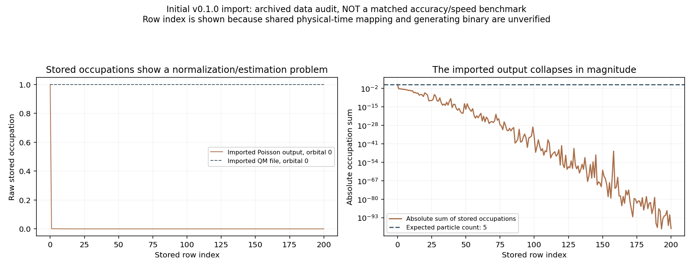

# 第一版泊松与当前 v1.14 的比较

更新：2026-09-08。此前六版同条件重跑从 v0.93 开始，并未覆盖第一版。本次追溯 v0.1.0 和原始 SepMB 快照，分别说明它们与当前算法的关系。

## 首先确定“第一版”

最早 Git 标签 v0.1.0 对应 2026-06-14 初始导入，提交 9ccb374af3704e048a2f6c5753ba12c46d662311。实际保存的实现是 ahm-cs-mb.cpp 中的 AHM::MBpoisson，并没有 ahm-mb-sep.cpp。

当前 SepMBpoisson 的另一个原始前身保存在 v0.10.0 的 archive/ahm-mb-sep-before-v030.cpp。这个文件明确说明目标是直接求观测量平均，避免构造最终完整波函数。它与最早 MBpoisson 不能混为一谈；快照保存时间也不等于该算法首次编写时间。

本次把两份历史源码和随初始导入保存的两份数据做了原文快照，路径为 scan_initial_poisson_audit_20260908。audit.json 记录 Git 对象和 SHA256，analyze_initial_poisson.py 会核对内容。

## 思路与存储的区别

| 项目 | v0.1.0 的 MBpoisson | 原始 SepMBpoisson | 当前 v1.14 |
| --- | --- | --- | --- |
| 核心估计 | 随机电子跃迁、相干核路径，先求平均波函数再分析 | 随机前后路径配对，直接估计观测量 | 有界确定性参考 + 随机路径残差 |
| 全波函数 | 保存时间 × 完整电子基 × 核网格的数组 | 函数本身不分配上述波函数数组 | 仅参考空间保存工作波函数；随机部分按路径存储 |
| 电子状态 | 完整 occ 基组及状态索引搜索 | 当前占据/空轨道集合，条件路径采样 | 路径局部表示，入口明确跳过完整基组，参考状态用位掩码 |
| 主要辅助内存 | 完整波函数历史；MPI 平均时再分配等大数组 | 时间 × 轨道相位表、Kondo 条件路径表及观测量 | 两个分布式参考工作数组、稀疏符号图、路径辅助表和输出 |
| 降低方差 | 无现有有界参考控制 | 条件后向路径，尚无当前参考控制与分层组合 | 参考控制、分层/随机化重复及跳过零残差工作 |
| 主要问题 | 累加实现缺陷及组合规模存储 | 时间标签、数组边界、估计器正确性和长时间方差 | 参考空间成本、长时间残差波动及有限步/分层偏差 |

原始 SepMB 函数内未发现 Nhs/完整 occ 基组访问；它本身已经有低内存思想。历史完整主程序入口未随 v0.1.0 保存，不能据这个函数推断当时整个进程一定生成、或者一定不生成完整电子基组。

因此：相对最早 MBpoisson，当前大幅改变了存储方式；相对原始 SepMB，当前的关键变化是纠错和参考控制，不能笼统宣称当前任何情况下都更省内存。为了降低随机方差，确定性参考确实增加了内存成本。

## 能从源码确定的容量差别

最早 MBpoisson 开启 _YYY_REALSPACE_AV_，nwf=nstep/5，分配 wf[nwf+1][Nhs][npt]；MPI 路径还分配同尺寸 avg。统一假设 4000 a.u.、dt=0.5、8000 步、1024 核网格点、复数双精度，则保存 1601 个波函数时间片。

| 10 轨道 / 5 电子的条目 | 容量或测量 | 证据类型 |
| --- | ---: | --- |
| 单个全空间 QM 波函数 | 3.9375 MiB | 数组容量估算，不含其他内存 |
| 最早 MBpoisson 的 wf 数组 | 6.156 GiB / 进程 | 源码公式估算，未实际重跑 |
| 最早 MBpoisson 的 wf+MPI avg | 12.312 GiB / 进程 | 同上，两个数组共存时的组件容量 |
| 当前完整网格 QM 进程峰值 | 19.395 MiB，1 进程 | 647783 实测，4000 a.u. |
| 当前 v1.14 百万路径采样最大进程峰值 | 15.574–15.660 MiB，64 进程 | 647718–647720 实测；峰值和 0.858–0.866 GiB |

前两种统计口径不同，不能据此计算实际 RSS 加速/压缩倍数。容量公式只适用于最早 MBpoisson，不能套到原始 SepMB 身上。大体系中整数/索引范围也可能先于容量限制导致程序失败。

当前 v1.14 的 50/25、D2 首次 4000 a.u. 作业已经实测：21.973 小时，128 进程最大峰值 199.047 MiB，峰值和 24.486 GiB；后续缓存一万路径 14.316 分钟，最大进程峰值 27.504 MiB，峰值和 3.040 GiB。峰值和不是同时总 RSS。采样精度仍未通过，详细对照见 QM_POISSON_COMPARISON_4000.md。

## 初版的正确性问题与数据限制

v0.1.0 的 MBpoisson 在每个轨迹测量处将生成器输出直接写入最终波函数槽位，没有独立的加法累积。v0.2.0 明确修复为“先生成临时轨迹贡献，再 += 累加”。原始生成器实现未随初始标签完整保存，因此现存的 text 数据究竟由哪个二进制/函数生成，不能仅凭同一目录和文件名确定。

源码还显示：jc 仅分配 nstep 项，却可能访问 nj=nstep；三维波函数按二维释放；辅助 realloc1d 存在两个参数的 malloc 调用；Johnson 的 .cpp 只是类声明占位。这些均有后续修复记录。初始标签缺主程序、构建文件及多项模型/核运动实现，标签本身不足以独立构建；不等于当时服务器没有完整程序。

原始 SepMB 存在另一类问题：在 j%nbloc==0 时采样，累积到 prb[j/nbloc]，输出却标记 t*dt，漏了 nbloc；奇偶表达式 2*d-excited0^excited 缺明确括号；后向跳跃数组 Jmax 可能小于实际跳数；输出是未归一化量，不能仅靠后处理强制守恒宣称估计器正确。

初始导入的 text 1000 10 5 (0).dat 有 201 行，印出的时间是 0–100；QM 文件有 8001 行，印出 0–4000。若当时 nstep=8000 且使用原始 SepMB 逻辑，nbloc=40，会发生这一类时间压缩标签问题；但缺生成记录，不能直接替该文件改成 4000 a.u.。

该历史输出的占据数总和首行为 5，第二行约 0.0045584，最后约 2.385e-101，且有 90 行总和为负。它的数值显然不能直接解释为可靠的物理占据数；这不等于已凭该文件确定唯一错误来源。配套历史 QM 也未重新核验为正确的全多电子传播，图仅展示归档内容。

历史文件与配套 QM 的浴参数头相同，但与当前受控实验不同：杂质能量约 +0.137810 Ha，而现在为 −0.6319 Ha；浴耦合为 0.00333333 Ha，而现在为 0.000182574 Ha。因而不能把旧文件与现在结果直接拼成公平的 Q 或速度排名。

## 目前可下的结论

- 当前相对最早 MB 实现，在正确性修复、存储结构及大空间执行能力上有明确进展。
- 当前相对原始 SepMB，增加参考控制以改善方差，也支付了额外确定性计算和内存成本；低内存思想并非现在才有。
- 初版没有保留下可核验的同参数运行时间、真实 RSS 和完整时间映射，因此初版的同条件 4000 a.u. Q、速度比、实际内存比均留空，不作估造。
- 原样带缺陷的代码和“保留原始思路、只修复必要错误的初版基线”必须分开标记；后者尚未完成受控重建重跑。已有 v0.93 对照也不能冒充第一版。

