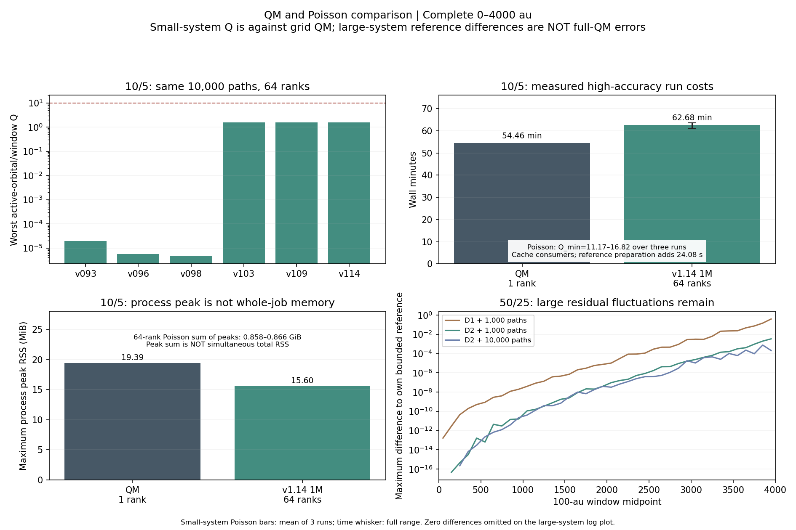

# QM 与各版泊松：4000 a.u. 的可核验比较

更新：2026-09-08。结论是：现有 v1.14 在同一采样配置下明显加快了部分旧泊松实现，但小体系的整体成本仍不优于可直接运行的 QM；大体系解决了存储容量入口，尚未实现可靠高精度。

## 同一小体系、同一路径数的六版实测

全部为 10 轨道 / 5 电子、0–4000 a.u.、dt=0.5、wc=2.7 eV、eta=3e-7、delE=-17.194874968839816 eV。每版 10000 条路径、64 进程、种子 1158001，同一集群。实际浴能量/耦合、完整时间网格、随机求解分支和二进制 SHA 均核对。

Q = RMS(QM 占据数变化) / RMS(Poisson 与 QM 占据数差异)。最差 Q 指杂质 0 与初始空轨道 5–9 中，所有 100 a.u. 窗口的最小值；目标为单次最差 Q>10。全程综合 Q 可掩盖个别轨道、个别窗口的失败。100 a.u. 窗口按现有脚本含两端点，相邻窗口共享端点。

| 留存程序 | 最差 Q | 全程综合 Q | 墙钟秒 | 最大进程峰值 MiB | 全轨道最大绝对误差 |
| --- | ---: | ---: | ---: | ---: | ---: |
| v093 | 1.93021e-05 | 8.57162e-05 | 39.08 | 14.781 | 0.0326526 |
| v096 | 5.61004e-06 | 4.39163e-05 | 43.88 | 14.805 | 0.110164 |
| v098 | 4.58675e-06 | 3.68442e-05 | 45.99 | 14.977 | 0.184254 |
| v103 | 1.59071 | 22.356 | 275.54 | 15.953 | 3.68775e-07 |
| v109 | 1.58241 | 23.9925 | 471.94 | 15.965 | 3.68776e-07 |
| v114 | 1.58241 | 23.9925 | 55.92 | 15.418 | 3.68776e-07 |

六版在一万路径下都没有达到最差 Q>10。v1.03/v1.09/v1.14 的参考控制明显降低残差，但当前样本数仍不够。v1.09 与 v1.14 占据数最大差异仅 1.44e-15，本次墙钟速度比为 8.44；这支持实现优化保持了该配置的结果，不证明任意规模都有同样加速。

这不是各版本各自调到相同误差后的最终成本排名。旧版不支持的参数可能被忽略，例如 v0.93 实际没有应用速率倍数 1.5。旧输出的 PATCH_CHECK 横幅也可能保留早期名称；以记录的文件、SHA 和实际分支为准，不能仅凭名称声称它从某个 Git 标签重新编译。历史短时间或不同路径数的高 Q 不混入本表。

## QM 与实际达到指标的 v1.14

QM 是完整多电子网格数值基准，1024 个核网格点、252 个电子组态。资源补测在 MPI 内包住实际求解器，排除启动器内存混淆。QM 自身仍有时间步和网格误差，不将它的 Q 写作无限大或零误差。

| 方法 | 进程数 | 墙钟分钟 | 最大进程峰值 MiB | 进程峰值和 GiB | 分配进程小时 | 精度 |
| --- | ---: | ---: | ---: | ---: | ---: | --- |
| QM，647783 | 1 | 54.4565 | 19.395 | 0.01894 | 0.9076 | 固定网格/步长的数值基准 |
| v1.14，100 万路径，种子 1144001 | 64 | 63.560 | 15.660 | 0.8660 | 67.797 | 最差 Q=11.858 |
| v1.14，100 万路径，种子 1144002 | 64 | 60.963 | 15.578 | 0.8578 | 65.027 | 最差 Q=11.169 |
| v1.14，100 万路径，种子 1144003 | 64 | 63.521 | 15.574 | 0.8576 | 67.756 | 最差 Q=16.821 |

泊松三次都独立通过 Q>10；此处没有用种子平均凑达标。三次均复用同一 D3/F384 参考，首次还需约 24.08 秒的参考生产；生产任务最大进程峰值 15.684 MiB、峰值和 0.856 GiB。D3 已覆盖 246/252 个组态，因此小体系高精度部分得益于接近完整的确定性参考。

分配进程小时 = 进程数 × 墙钟小时，不是实际 CPU 时间。QM 实测用户+系统 CPU 为 0.9074 小时；这三次泊松没有同口径 CPU 记录。峰值和是各进程峰值相加，不是同时总 RSS。不能以泊松单进程约 15.6 MiB 小于 QM 19.4 MiB，就宣称 64 进程整项作业更省内存。

对这个小体系，QM 更快、并行资源需求也更少；当前泊松配置没有整体成本优势。

## 50/25 的最新比较：完成了运行，还没完成高精度验证

完整空间 C(50,25)=126410606437752。仅一个复数双精度、1024 核网格点的全空间 QM 波函数约需 1.7964 EiB（2.0711 EB），不含其他数组。这是容量下界估算，未实际运行 50/25 全空间 QM。

当前 v1.14 的 D2 参考只有 725426 组态。所有下列作业均覆盖 0–4000 a.u.：

| 模式 / 作业 | 进程 | 墙钟分钟 | 最大进程峰值 MiB | 峰值和 GiB | 相对自身参考最大占据差异 |
| --- | ---: | ---: | ---: | ---: | ---: |
| D1 参考 + 1000 路径，647780 | 64 | 13.381 | 27.668 | 1.532 | 0.377997 |
| D2 参考 + 1000 路径，647777 | 128 | 1318.379 | 199.047 | 24.486 | 0.00328652 |
| 复用 D2 + 10000 路径，647778 | 128 | 14.316 | 27.504 | 3.040 | 0.000740303 |
| 无参考 + 1000 路径，647782 | 64 | 7.847 | 26.137 | 1.506 | 不适用 |

D2 首次作业墙钟 21.973 小时，其中确定性参考传播 21.713 小时，采样约 15.53 分钟；后续缓存采样约 14.316 分钟，不能把它当作首次总成本。

D2 的一万路径结果仍出现 −2.195e-4 的占据数，最弱活跃轨道窗口的“参考信号 / 相对参考差异”仅 1.760e-4。该指标不是与全空间 QM 的拟合 Q。D1 与 D2 的确定性参考最大差异仅 5.662e-15，增加这一层参考并没有改变确定性信号，但随机估计波动仍很大。相邻截断一致不是严格全空间误差界；F384/F512 对照 647779 仍在运行。

因此，现阶段可以证明低内存地执行了大组合空间模型，不能声称以可接受时间获得了完整 QM 同等精度。无参考试跑同样存在严重波动。小样本还叠加了固定中点事件概率舍入误差：50/25 的 1000 路径为 −31.74%，10000 路径为 +2.39%；这不是占据数误差百分比。

## 各阶段方法的贡献和边界

| 版本阶段 | 主要变化 | 已支持的结论 |
| --- | --- | --- |
| 早期至 v0.92 | 压缩后向条件计数/相位表，避免部分时间平方存储 | 降低表格内存；旧驱动仍可能构造完整电子基组 |
| v0.93–v0.98 | 自动分支及速率、轨道、时间和后向路径分层 | 随机分支仍受长时方差影响；自动确定性分支不能混称为纯泊松结果 |
| v0.99–v1.09 | 有界参考控制、随机化重复、嵌套分步残差 | 本次小体系相对早期随机算法显著改善精度；参考误差与随机误差需分开检查 |
| v1.10–v1.11 | 路径局部表示，跳过完整基组；参考传播分布到多进程 | 能进入组合空间巨大而完整 QM 不可存储的模型 |
| v1.12–v1.14 | 位掩码、稀疏图、两个工作数组、参考缓存、符号压缩 | 存储/执行效率优化；短测数值回归和本次 v1.09/v1.14 对照支持保持结果，未解决大体系长时方差 |
| 集体跃迁 / Slater 原型 | 每次事件直接处理浴轨道求和，保留随机泊松时间 | 基础算子/路径核验证已通过，但控制变量衔接未完成，尚无完整生产性能比较 |

当前实现符合所提供论文用时间换内存的方向，但其有界参考有额外内存成本。论文连续时间恒等式不能直接保证当前有限时间步、分层与归一化实现无偏；论文单电子型算例也不能替代半填充多电子验证。

原始六版数据见 scan_versions_4000_20260907，QM 资源及 50/25 数据见 scan_v115_generality_20260906，小体系百万路径见 scan_v114_signed_csr_20260906。分析入口：analyze_versions_4000.py、analyze_qm_resources_4000.py、analyze_v115_large_4000.py；汇总图由 plot_qm_poisson_comparison_4000.py 生成。

关于第一版：六版重跑从 v0.93 开始，并不代表 v0.1.0。已另核对最早 MBpoisson 与原始 SepMBpoisson，它们的存储结构不同；源码、初始数据异常、容量估算和缺少的实测依据见 [INITIAL_POISSON_COMPARISON.md](INITIAL_POISSON_COMPARISON.md)。
