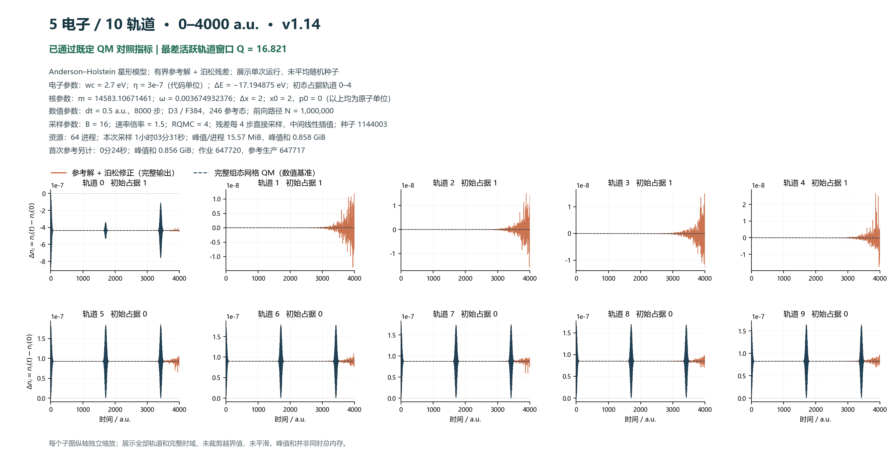
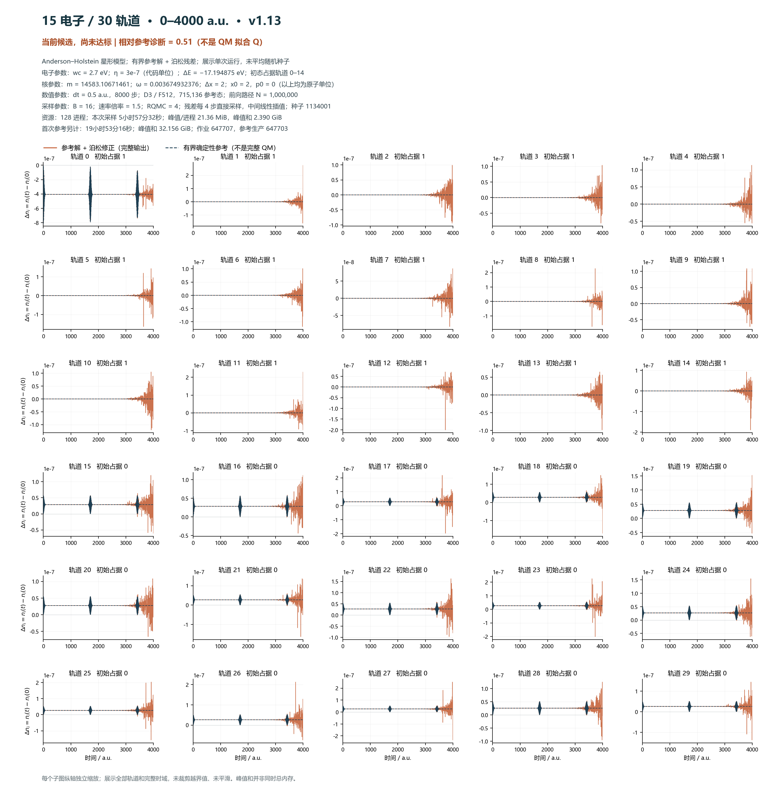
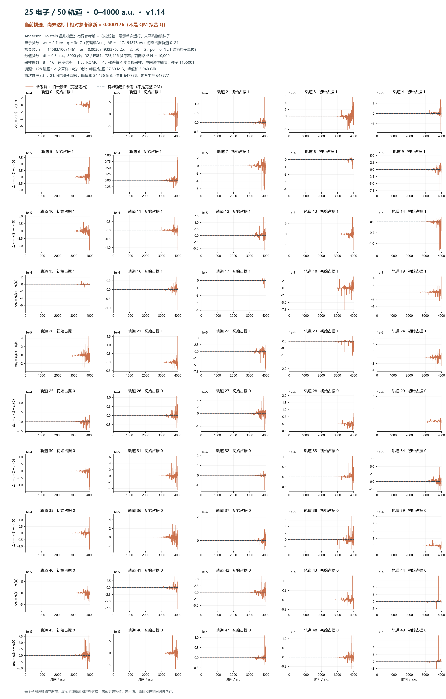

# 三种体系的现有最佳候选全轨道图（2026-09-08）

记号统一为 **电子数 / 轨道数**。三张图均为 **0–4000 a.u. 的单次完整「有界确定性参考 + 泊松残差」输出**。5/10 已通过现有 QM 对照指标；15/30、25/50 尚没有达到长时间高精度目标，不能把这三张图统称为高拟合成果。

图中纵轴为占据数变化 Δn_i = n_i(t) − n_i(0)。轨道从 0 编号，前 Ne 个轨道初始占据为 1，其余为 0。每轨道独立缩放并显示量级，以免把 1 附近的微小波动隐藏。橙线为完整混合输出；深色虚线在小体系为完整组态网格 QM，在大体系仅为有界参考。原始输出已归一化，随机残差每 4 步直接采样，中间由原程序线性插值；本次绘图未额外平滑、裁剪、截断时域或平均种子。

## 选择结果与参数

“最佳”仅指下方候选集合中，事后观察到的最差活跃轨道 100 a.u. 窗口比值最高的单次运行，不是可靠的最优参数证明。小体系比值 Q = RMS(QM 占据数变化) / RMS(输出与 QM 的差异)，活跃轨道为 0、5–9，既定目标 Q>10；近乎静止的轨道 1–4 另看绝对误差。Q 不是 R²，也不是每点相对误差。大体系用参考代替 QM 计算的比值仅供残差诊断，不能判定真实精度，亦不能跨体系直接排名。

| 体系 | 作业 / 版本 | 前向路径 N | 参考截断 / 参考态 | 种子 | 进程 | 最差窗口指标 |
| --- | --- | ---: | --- | --- | ---: | ---: |
| 5/10 | 647720 / v1.14 | 1,000,000 | D3/F384 / 246 | 1144003 | 64 | 16.8211185 （QM Q） |
| 15/30 | 647707 / v1.13 | 1,000,000 | D3/F512 / 715,136 | 1134001 | 128 | 0.510276424 （参考诊断） |
| 25/50 | 647778 / v1.14 | 10,000 | D2/F384 / 725,426 | 1155001 | 128 | 0.000176048804 （参考诊断） |

共同物理参数：Anderson–Holstein 星形模型；wc = 2.7 eV，eta = 3e-7（代码单位），ΔE = −17.194874968839816 eV；质量 m = 14583.106714608701 a.u.，核频率 ω = 0.0036749323758566211 a.u.，位移 Δx = 2，初始 x = 2、p = 0。

共同数值参数：dt = 0.5 a.u.、8000 步；后向副本 B = 16，速率倍率 1.5，RQMC = 4；路径局部模式；前向按步分层开启；随机残差测量间隔 4 步。D 是参考空间相对初态的电子激发距离上限，**不是总跳跃次数上限**；F 是核振动 Fock 基数。完整配置、源数据位置和 SHA256 校验值见 [selection_and_parameters.json](selection_and_parameters.json)。小体系 QM 使用 1024 点核网格 [−8,8]、dt = 0.5；它是固定离散的数值基准。

## 实测成本

| 体系 | 缓存采样墙钟 | 采样最大进程峰值 MiB / 峰值和 GiB | 首次参考生产墙钟 | 参考最大进程峰值 MiB / 峰值和 GiB | 首次累计小时 |
| --- | ---: | ---: | ---: | ---: | ---: |
| 5/10 | 1.0587 小时 | 15.574 / 0.8576 | 0.0067 小时 | 15.684 / 0.8558 | 1.0654 |
| 15/30 | 5.9589 小时 | 21.355 / 2.3897 | 19.8879 小时 | 258.992 / 32.1563 | 25.8467 |
| 25/50 | 0.2386 小时 | 27.504 / 3.0400 | 21.9730 小时 | 199.047 / 24.4858 | 22.2116 |

墙钟为日志记录的完整作业执行时间，不含排队；缓存采样列包括读取缓存等开销。参考生产作业还包含当时的小样本试采样，因此首次累计是按现存工作流相加的实际成本，未剔除试跑。进程峰值和不是同一时刻的总 RSS。两阶段先后运行，内存不能相加。大体系首次生产参考仍需要约 24–32 GiB 的进程峰值和，不能只报约 2–3 GiB 的缓存采样内存。

## 结果含义

- **5/10：可用主成果。** 本次选 647720；另两个独立百万路径种子也分别达到 Q=11.858、11.169。所选运行全轨道最大绝对差为 2.874e-8，近静止轨道末段仍有噪声。D3 包含 246/252 个电子组态，不能据此证明大空间也能高精度。
- **15/30：容量验证与候选结果。** 最新 647707 的 F512 相对参考诊断为 0.510276，F384 的 647704 为 0.510274，差异极小；两条完整输出最大差仅 9.696e-11。F512 增加了参考成本，未显示有意义的精度收益。所选结果与参考最大差 2.764e-7，最低占据 −2.345e-7，末段随机误差仍未解决。
- **25/50：现有候选仍明显失效。** 所选 D2/F384 万路径结果与参考最大差 7.403e-4，最低占据 −2.195e-4。相比千路径试跑更好，但不是高拟合成果。新增 F512 参考与 F384 最大差 2.243e-11，扩大振动基未消除随机残差问题。

方法保留泊松事件、路径权重与前后向贡献，并在路径局部模式避免完整电子组态波函数；增加路径主要增加时间。它符合当前约定的“泊松低内存、用时间换内存”的优化方向，但属于含确定性参考的控制变量混合方法。参考成本必须计入；大体系的高拟合普适性尚未证实。小体系完整 QM 实测单进程约 54.46 分钟、19.395 MiB，当前混合方法未在这一小体系体现总体成本优势。

## 全轨道图

### 5 电子 / 10 轨道

[完整配置](../scan_v114_signed_csr_20260906/647720/config.txt) · [原始占据数据](../scan_v114_signed_csr_20260906/647720/ahm-sepmb-s10-n5-1000000.dat) · [对照曲线数据](../scan_v113_two_buffer_20260905/647656/ahm-qm-s10-n5.dat)

### 15 电子 / 30 轨道

[完整配置](../scan_v113_two_buffer_20260905/647707/config.txt) · [原始占据数据](../scan_v113_two_buffer_20260905/647707/ahm-sepmb-s30-n15-1000000.dat) · [对照曲线数据](../scan_v113_two_buffer_20260905/647703/reference-observables.dat)

### 25 电子 / 50 轨道

[完整配置](../scan_v115_generality_20260906/647778/config.txt) · [原始占据数据](../scan_v115_generality_20260906/647778/ahm-sepmb-s50-n25-10000.dat) · [对照曲线数据](../scan_v115_generality_20260906/647777/reference-observables.dat)

## 候选范围与最新收齐的数据

候选指标如下。排除了 30 轨道只有 100 路径的参考生产试跑，以免稀有事件严重漏采造成虚假接近参考；排除了电子数不符的 17/50；关闭参考的失效消融不属于本次混合候选集合。旧版本、较短时间及不同物理参数不与这里混为一个排名。

| 体系 | 作业 | 最差窗口比值 |
| --- | --- | ---: |
| 5/10 | 647718 | 11.8580147 |
| 5/10 | 647719 | 11.1694567 |
| 5/10 | 647720 | 16.8211185 |
| 15/30 | 647704 | 0.510273721 |
| 15/30 | 647705 | 0.458576383 |
| 15/30 | 647706 | 0.295383216 |
| 15/30 | 647707 | 0.510276424 |
| 15/30 | 647807_0 | 0.161514594 |
| 15/30 | 647807_1 | 0.0256857021 |
| 15/30 | 647807_2 | 0.18179448 |
| 15/30 | 647807_3 | 0.336026578 |
| 15/30 | 647807_4 | 0.29150463 |
| 15/30 | 647807_5 | 0.500121444 |
| 25/50 | 647777 | 3.19646486e-05 |
| 25/50 | 647778 | 0.000176048804 |
| 25/50 | 647779 | 3.1967781e-05 |
| 25/50 | 647780 | 3.55124185e-07 |

本次收齐 647707、647779 和 647807_3/4/5，并重算完整性、参考缓存和资源记录。15/30 的 10 万路径筛选中，关闭按步分层、保持速率 1.5 的两次诊断为 0.292、0.500，优于同种子的原设置 0.162、0.0257，但仍远低于目标，且不是 QM 真值误差；两个种子不足以确立稳健收益。详见 [采样对照](../scan_rate_4000_20260907/README.md)。

复现绘图：在仓库根目录运行 `python plot_best_orbitals_20260908.py`。脚本从原始文件重算选择指标，验证 8001 个时间点、参数与参考缓存，并生成三张全分辨率 PNG 和较小预览。图中参数来自实际 config 和参考 key。当前图表使用已完成作业，不包含工作区尚未验证的候选 C++ 改动。

阶段回退点：[v1.14-best-orbitals-20260908](https://github.com/nihility1shadow/qm_project/tree/v1.14-best-orbitals-20260908)。
