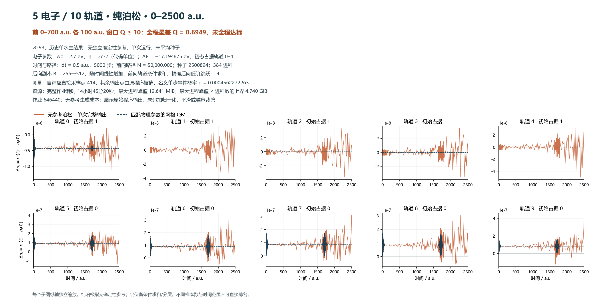
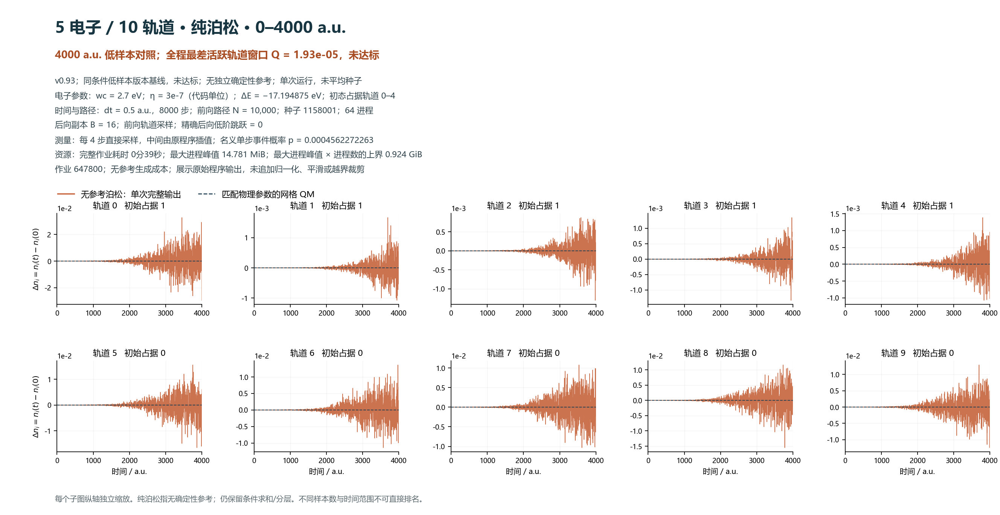
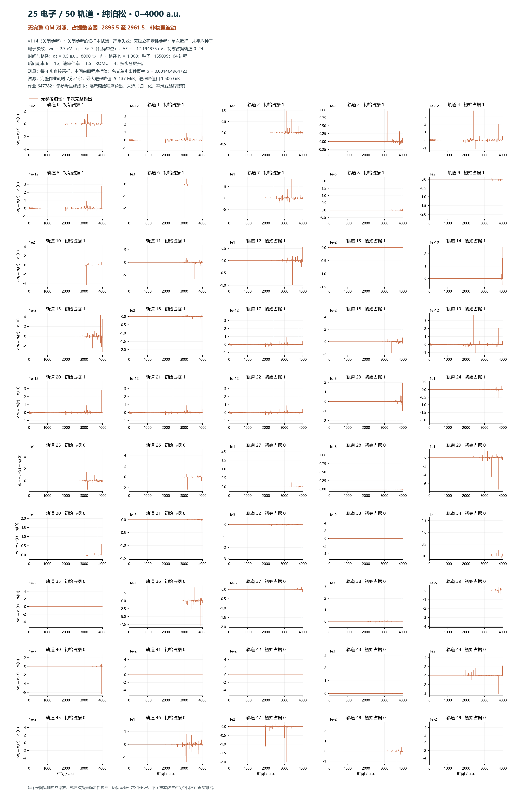

# 无确定性参考的泊松轨道图（2026-09-08）

本包只展示已完成、已有原始记录的无参考泊松结果，没有启动新模拟。记号为电子数 / 轨道数。**5/10 的历史主单次结果覆盖 2500 a.u.；另附 4000 a.u. 的小样本版本基线。25/50 只有关闭参考的 4000 a.u. 低样本试跑，已严重失效。当前归档未找到可核验的 15/30 无参考长测输出。**

这里的“纯泊松”指没有独立确定性参考波函数传播，也没有使用参考曲线替代随机结果；仍保留条件求和、精确低阶后向贡献及分层等降噪措施。不能等同于最早未经修正的 MBpoisson，也不能等同于所有电子通道均只保留单条随机路径。

三张图均显示全部轨道的 Δn_i = n_i(t) − n_i(0)，轨道从 0 编号，初始占据前 Ne 个轨道。纵轴独立缩放；图中保留原始完整输出，未新增平滑、归一化、越界裁剪或跨种子平均。原程序的稀疏直接测量和中间插值已在图中注明，输出点数不等于独立随机测量点数。

## 5/10：历史主单次结果，2500 a.u.

- v0.93，作业 646440，前向路径 5000 万，384 进程，随机种子 2500824。
- 后向副本从 256 到 512 随时间线性增加；前向轨道条件求和；精确后向跳数 4；全阶后向 DP 开启。
- dt = 0.5 a.u.，5000 步；日志记录 414 个直接测量点，其余输出由原程序插值；回归附近加密半宽 80 a.u.、步长 3。
- 完整作业历史记录 **14小时45分20秒**；最大进程峰值 **12.641 MiB**。最大进程峰值乘以 384 的上界为 **4.740 GiB**，不是实测各进程峰值和。
- 每个 100 a.u. 窗口取活跃轨道 0、5–9 中最小 Q；Q = RMS(QM 占据数变化) / RMS(泊松与 QM 的差异)。前 0–700 a.u. 的全部窗口 Q≥10；完整 2500 a.u. 最差 Q = **0.694880**，没有全程达标。近静止轨道 1–4 应另看绝对误差，不能声称所有轨道均高相对精度。
- 这里使用匹配物理参数的 QM 作业 646419。14小时45分是完整 2500 a.u. 的费用；历史提及的约 31 小时是增样估算，没有对应已完成结果。

[原始输出](../scan_v093_poisson_t2500_20260822/final_50m_job_646440/ahm-sepmb-s10-n5-50000000.dat) · [QM](../scan_v093_poisson_t2500_20260822/pilots/qm_646419_eta03/ahm-qm-s10-n5.dat) · [运行配置](../scan_v093_poisson_t2500_20260822/final_50m_job_646440/run-info.txt) · [历史报告与耗时来源](../scan_v093_poisson_t2500_20260822/final_report.md)

## 5/10：4000 a.u. 低样本版本基线

v0.93，作业 647800，前向 1 万路径、B=16、64 进程、种子 1158001，dt=0.5、8000 步，每 4 步直接测量。墙钟 **39.08 秒**，最大进程峰值 **14.781 MiB**，乘进程数的内存上界 **0.924 GiB**。最差窗口 Q = **1.9302e-5**，未达标。这是已发布六版本同路径预算实验中的一项，不是为同一精度目标调优后的纯泊松最优配置，也不能与 5000 万路径的 2500 a.u. 结果直接比较。

该作业沿用统一环境配置，其中包含 v0.93 尚不支持的参考、速率倍率与 RQMC 变量；这些变量不应被当成旧二进制的实际设置。实际采样以输出头为准，名义单步跳跃概率为 0.0004562272263。版本归属由已有六版本源码/二进制审计确定，旧输出的 PATCH_CHECK 字符串不是版本判据。

[原始输出](../scan_versions_4000_20260907/647800/ahm-sepmb-s10-n5-10000.dat) · [实际运行日志](../scan_versions_4000_20260907/647800/program.out) · [版本比较](../QM_POISSON_COMPARISON_4000.md)

## 15/30：缺少可核验的无参考长测

本次核对的 15/30 原始长时间结果使用 D1、D2 或 D3 参考；不能从完整混合输出减去参考曲线，再把残差称作纯泊松轨道图。残差的抽样与控制变量规则不同于关闭参考后的完整估计器。当前没有对应可交付图，保留为空，不用其他体系或参考结果代替。

## 25/50：关闭参考的 4000 a.u. 试跑

v1.14，作业 647782；程序日志明确记录 `selected_distance=-1 active=0 states=0` 和跳过完整电子基组。前向 **1000 路径**、B=16、64 进程、种子 1155099；速率倍率 1.5、RQMC=4、按步分层开启；dt=0.5、8000 步、每 4 步直接测量。完整作业 **470.83 秒（7分51秒）**，最大进程峰值 **26.137 MiB**，进程峰值和 **1.506 GiB**，不是同时总 RSS；没有参考生产成本。

最低占据数 **−2895.50**，最高 **2961.46**，已严重失效，且没有完整 QM 对照。这个小样本同时存在已审计的事件概率舍入误差，不能把异常全部归因于某一个方差机制，也不能把它作为充分增样后的纯泊松精度极限。已有输出的归一化不能保证每条轨道占据数合理。

[原始输出](../scan_v115_generality_20260906/647782/ahm-sepmb-s50-n25-1000.dat) · [实际配置](../scan_v115_generality_20260906/647782/config.txt) · [运行与资源日志](../scan_v115_generality_20260906/647782/program.out)

## 共用物理参数与复现

wc = 2.7 eV，eta = 3e-7（代码单位），ΔE = −17.194874968839816 eV。小体系两幅图均重新验证与 QM 的浴参数和时间网格完全匹配，并重新计算最差活跃轨道窗口 Q。物理模型沿用前一阶段；本包没有调参或修改求解器。

[参数、来源校验值和重算指标](parameters_and_validation.json)。复现绘图：在仓库根目录运行 `python plot_pure_poisson_orbitals_20260908.py`。SHA256 对应生成时的本地源文件字节；Git 自动换行转换可能改变字节校验值，但不改变数值。v0.93 的旧入口可能仍展开完整电子基组，小体系低 RSS 不能作为大体系普适低内存的证明。

阶段回退点：[pure-poisson-orbitals-20260908](https://github.com/nihility1shadow/qm_project/tree/pure-poisson-orbitals-20260908)。
