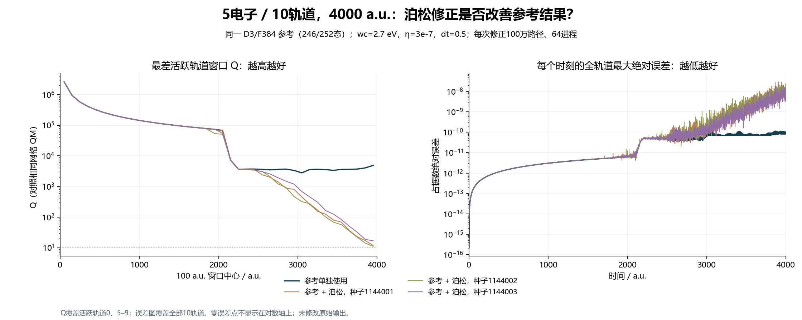

# 参考单独使用与泊松修正的直接对照（2026-09-08）

**在现有 5电子/10轨道、4000 a.u. 测试中，直接使用 D3/F384 参考更准确，也省去了约一小时的百万路径修正。此次对照没有证明泊松修正有实用收益。**

比较使用同一个参考生产作业647717、同一个固定网格QM基准647656，以及原有三个独立百万路径结果。重新核对8001点时间网格、缓存参数与校验和及浴参数；未平均种子、平滑或裁剪。参考原始观测量先按缓存规范归一化，再与原有完整输出进行相同指标比较。

| 输出 | 最差活跃轨道窗口 Q | 全轨道最大绝对误差 | 本阶段墙钟秒 |
| --- | ---: | ---: | ---: |
| 参考单独使用 | 2780.840633 | 1.441452513e-10 | 24.08 |
| 参考+泊松 1144001 | 11.858015 | 2.918262540e-08 | 3813.60 |
| 参考+泊松 1144002 | 11.169457 | 2.473788257e-08 | 3657.79 |
| 参考+泊松 1144003 | 16.821119 | 2.873597864e-08 | 3811.25 |

Q = RMS(QM占据数变化) / RMS(输出与QM的差异)，每100 a.u.窗口取活跃轨道0、5–9的最小值。越大越好。近静止轨道1–4包含在全轨道绝对误差中。参考生产24.08秒包括当时的小样本试跑，是现有参考生产作业的实测成本；三个修正耗时是复用参考后额外支付的时间。全程均64进程，不与单进程QM简单比较速度。

参考空间246/252态接近完整，现有参数下参考与QM已高度一致。百万路径估计带来的随机波动和可能的数值偏差，超过当前参考偏差；不能把“混合输出Q>10”解释为“泊松使参考更准确”。此比较不能单独分解随机方差、采样偏差与时间离散误差。

参考近似的优势是在可控内存内快速计算；泊松修正的研究价值，是在参考受内存限制、截断误差已不可忽略时，以增加采样时间降低这一误差。只有在固定内存预算下，校正后的误差实际小于参考单独误差，且收益可重复，才能证明这一价值。当前尚无这样的完整大体系实证。

15/30与25/50没有完整QM真值。相邻D/F参考一致只构成截断收敛证据，不能证明大体系参考已准确；现有修正结果也不能证明它纠正了参考。不能将本次小体系结论直接推广为所有情况下都无需随机修正。

后续评价必须包含：参考单独、参考加修正及可核验基准三者；比较固定内存下的实际误差与总时间。应先在可用完整QM的小体系设置明显的参考截断误差，再检验修正能否稳定恢复遗漏贡献，同时独立检查有限时间步和抽样偏差。未证明前，将“符合目标的研究设计”与“已验证有效的算法收益”分开陈述。

[完整指标与来源校验值](validation.json)。重现：在仓库根目录执行 `python analyze_reference_only_ablation.py`。这里只重算已有数据，不修改求解器或启动新采样。

阶段回退点：[v1.14-reference-only-ablation](https://github.com/nihility1shadow/qm_project/tree/v1.14-reference-only-ablation)。
